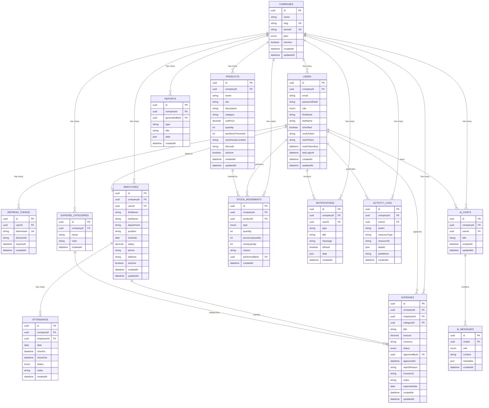

# Database Schema Diagram

14 tables — shared PostgreSQL database with row-level tenant isolation via `companyId`.

## Multi-Tenancy Design

Every table except `COMPANIES` has a `companyId` column. Every repository query includes `WHERE companyId = ?` extracted from the JWT. A valid token from Company A cannot read Company B data even if they share the same database.

## Key Design Decisions

| Decision | Reason |
|---|---|
| UUID primary keys | Don't leak row counts; safe to expose in URLs |
| `Decimal` for money | Float has rounding errors — `0.1 + 0.2 ≠ 0.3` exactly |
| Soft delete (`isActive`) | Preserves audit trail; prevents broken foreign key references |
| `STOCK_MOVEMENTS` as immutable ledger | Full history of every quantity change; `previousQuantity` + `newQuantity` stored so queries don't need to replay the log |
| `REFRESH_TOKENS` stores hashes | If the DB is breached, raw tokens are not exposed |
| `USERS` ↔ `EMPLOYEES` optional link | An employee can exist as an HR record without a login account |
| `Json` columns on logs/notifications | Variable structured data without extra tables |
